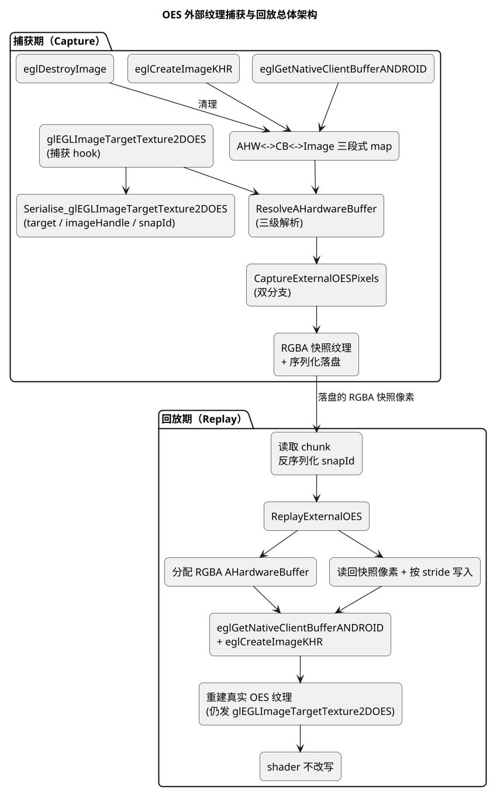
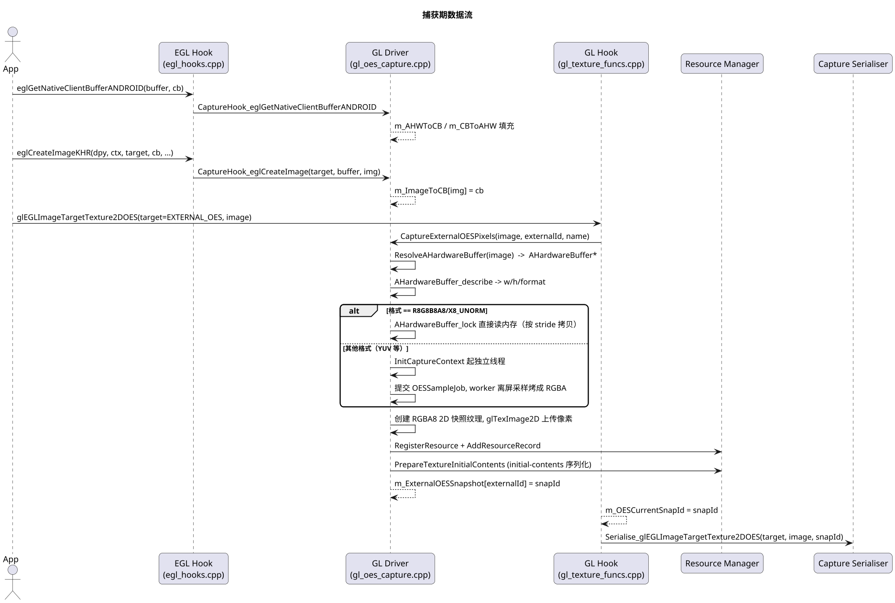
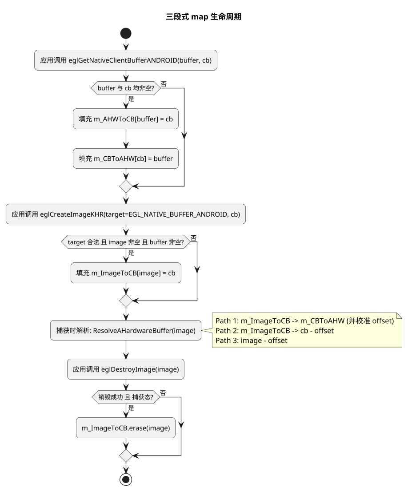
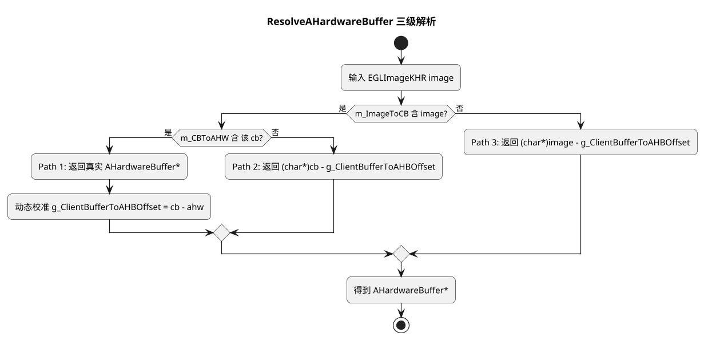
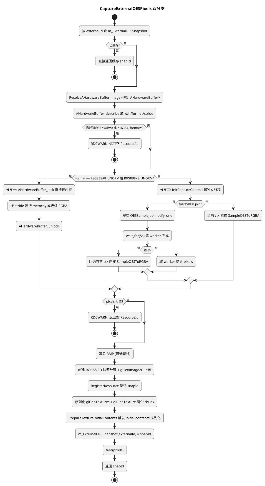
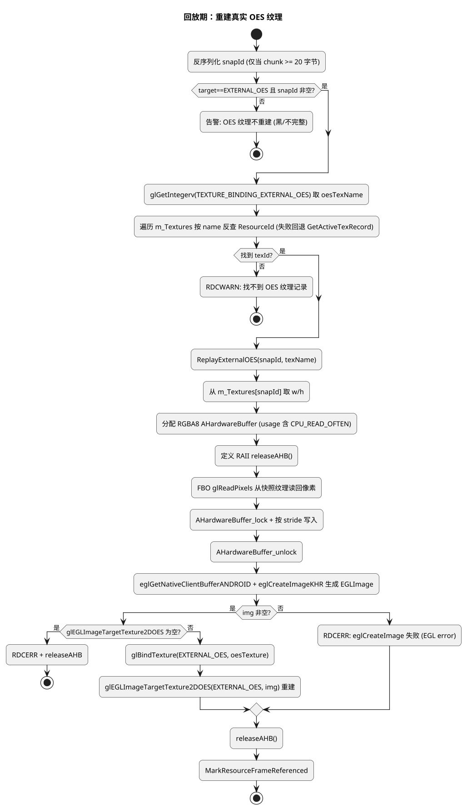
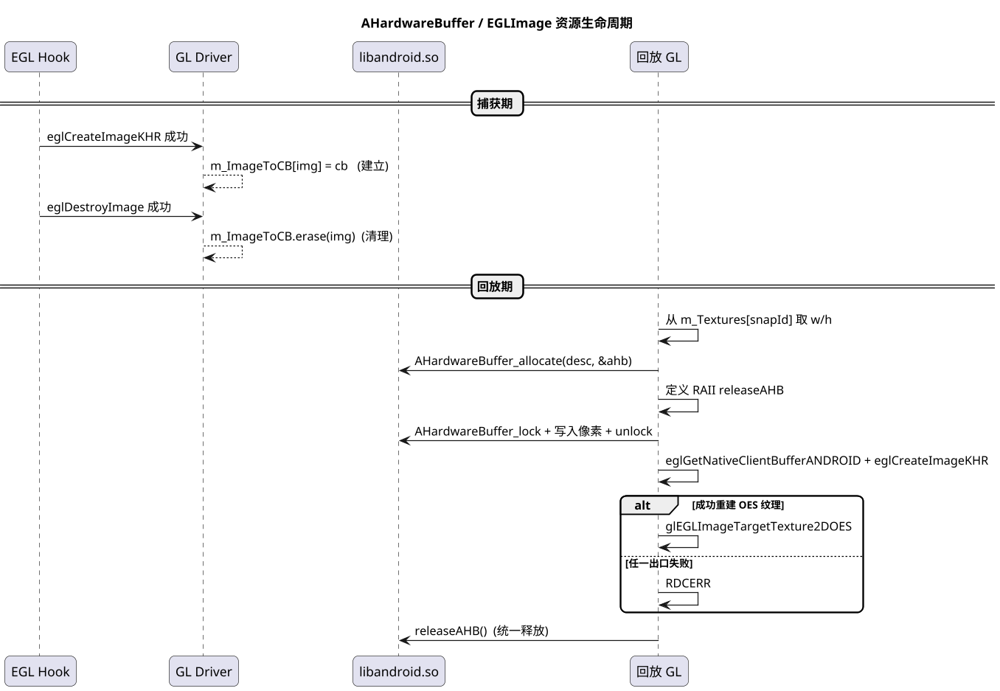
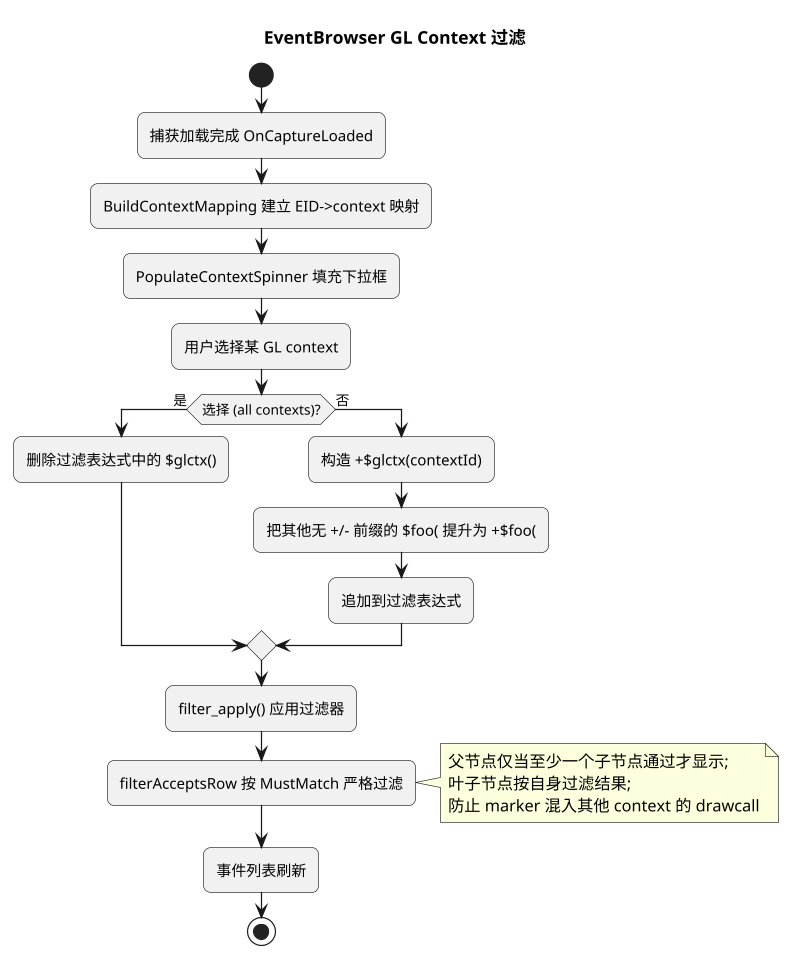
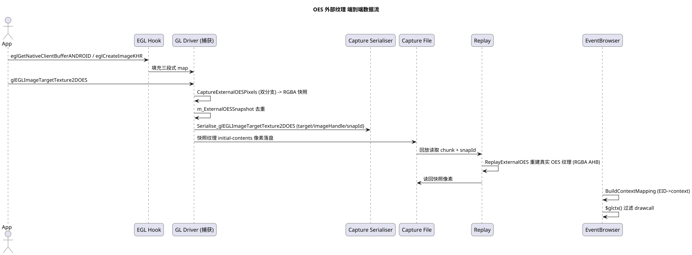

# OES 外部纹理捕获与回放完整设计详解

> 分类：RenderDoc / OpenGL 驱动 / 捕获与回放 / EventBrowser 过滤
> 适用范围：Android GLES（`OES_EGL_image_external`，`samplerExternalOES`，`GL_TEXTURE_EXTERNAL_OES`）
> 目标设备：小米 / OPPO / vivo，Android 9+
> 分支：v1.43_oes
> 编写日期：2026-08-02
> 说明：本文档按**功能主题**组织，完整覆盖 v1.43_oes 分支在 Android 外部纹理捕获上的全部设计，包括
> **OES 外部纹理捕获与回放**、**像素采样双分支**、**AHardwareBuffer / EGLImage 资源生命周期管理**，
> 以及配套的 **EventBrowser 按 GL Context 过滤**。所有流程均以 PlantUML 绘制。

---

## 目录

- [1. 背景与问题](#1-背景与问题)
- [2. 总体原理](#2-总体原理)
- [3. 关键数据结构](#3-关键数据结构)
- [4. EGL Hook 层：三段式链路 map 的建立与清理](#4-egl-hook-层三段式链路-map-的建立与清理)
- [5. AHardwareBuffer 运行时解析](#5-ahardwarebuffer-运行时解析)
- [6. 捕获端：像素获取与快照序列化](#6-捕获端像素获取与快照序列化)
- [7. 回放端：重建真实 OES 纹理](#7-回放端重建真实-oes-纹理)
- [8. 资源生命周期管理](#8-资源生命周期管理)
- [9. EventBrowser 按 GL Context 过滤](#9-eventbrowser-按-gl-context-过滤)
- [10. 完整数据流总览](#10-完整数据流总览)
- [11. 已知限制与风险](#11-已知限制与风险)
- [12. 涉及文件清单](#12-涉及文件清单)

---

## 1. 背景与问题

### 1.1 场景

在 Android 视频编辑 / 播放 / 相机预览应用中，应用层通过 `glEGLImageTargetTexture2DOES`
把由 `SurfaceTexture` / `EGLImage` 支持的外部纹理（`GL_TEXTURE_EXTERNAL_OES`）绑定到当前
纹理单元，再在着色器中使用 `samplerExternalOES` 采样。这类纹理承载的是视频帧、相机帧等
**动态、外部来源**的像素数据，是 RenderDoc 传统 2D 纹理捕获路径无法直接处理的。

### 1.2 根本障碍：OES 纹理是无存储纹理

`GL_TEXTURE_EXTERNAL_OES` 是一种**无存储纹理（storageless texture）**：驱动**不维护**
`TEXTURE_WIDTH` / `TEXTURE_HEIGHT` 等尺寸状态。由此带来一系列约束：

- `glGetTexLevelParameteriv(TEXTURE_WIDTH)` 返回 `0`，无法用该 API 取得尺寸。
- 应用通常也**不预先** `glTexImage2D` 分配存储，因此"从应用调用反推尺寸"的路径同样不可靠。
- OES 纹理**不能**通过 `glGetTexImage` 读回，也**不能**直接 attach 到 FBO 采样。

早先的"2D 快照 + `samplerExternalOES`→`sampler2D` 改写"方案依赖"能查询到 level-0 宽高"这一
前提，而该前提在 OES 纹理上**不成立**，因此该方案被推翻。

### 1.3 正确思路：尺寸与像素来自 AHardwareBuffer

外部纹理的像素实际由一块 **`AHardwareBuffer`** 承载，其尺寸是唯一可靠来源。像素经由如下
**完整链路**最终绑定成 OES 纹理：

```text
AHardwareBuffer
   │  eglGetNativeClientBufferANDROID   (显式绑定，C++ 路径)
   ▼
EGLClientBuffer (= void*)
   │  eglCreateImageKHR (target = EGL_NATIVE_BUFFER_ANDROID)
   ▼
EGLImageKHR
   │  glEGLImageTargetTexture2DOES
   ▼
GL_TEXTURE_EXTERNAL_OES (纹理)
```

只要在前两条边上用 hook 建立关联，到 `glEGLImageTargetTexture2DOES` 时即可由 `EGLImageKHR`
**反查**出 `AHardwareBuffer`，进而用 NDK 官方 API `AHardwareBuffer_describe` 拿到宽高，
再用 lock / 独立线程采样拿到像素。

> **偏移兜底**：Java `SurfaceTexture` 路径下，framework 不调用 `eglGetNativeClientBufferANDROID`，
> map 无法填充。此时 `EGLClientBuffer` 实际即为 `ANativeWindowBuffer*`，而 `ANativeWindowBuffer`
> 与 `AHardwareBuffer` 之间为固定偏移关系（初始经验值 `0x10`）。该值可在 map 链路成功解析时
> **动态校准**（见 §5），仅作为 map 查不到时的兜底，不参与状态机。

---

## 2. 总体原理

整体设计分为**捕获期**与**回放期**两条路径，核心思想如下：

1. **尺寸与像素来源全部从 `AHardwareBuffer` 取得**（NDK 官方 API，零布局假设）。
2. **捕获双分支**：RGBA_8888 格式走 `AHardwareBuffer_lock` 直接读内存；其余格式（YUV 等）
   走独立线程 + 独立 EGL context 离屏采样烤成 RGBA。
3. **快照纹理**：捕获到的像素被上传进一张 RGBA8 2D 快照纹理，并经标准 initial-contents 路径
   序列化落盘。
4. **回放保真**：回放端一律用 RGBA 的 `AHardwareBuffer` 重建真实 OES 纹理（仍发真实
   `glEGLImageTargetTexture2DOES`），**不再改写 shader**，规避 `samplerExternalOES` 兼容问题。

### 2.1 总体架构图（PlantUML）



### 2.2 数据流总览（PlantUML 时序）



---

## 3. 关键数据结构

全部位于 `renderdoc/driver/gl/gl_driver.h` 的 `WrappedOpenGL` 中，并由
`#if ENABLED(RDOC_ANDROID)` 包裹，仅 Android 构建生效。

### 3.1 三段式 map

```cpp
// AHW <-> CB 双向关联 (hook eglGetNativeClientBufferANDROID 时填充)
// 键用 const void* 而非 AHardwareBuffer*，以兼容 ANativeWindowBuffer 的指针语义
std::map<const void *, EGLClientBuffer> m_AHWToCB;
std::map<EGLClientBuffer, const void *> m_CBToAHW;

// Image <-> CB 关联 (hook eglCreateImageKHR 时填充, eglDestroyImage 时清理)
std::map<EGLImageKHR, EGLClientBuffer> m_ImageToCB;

// Java SurfaceTexture 路径兜底偏移 (ANativeWindowBuffer - offset = AHardwareBuffer)
// 初始 0x10，可在 map 链路成功解析时动态校准
int64_t g_ClientBufferToAHBOffset = 0x10;

// 外部 OES 纹理 ResourceId -> 已捕获 RGBA 快照 ResourceId (每帧清空)
std::map<ResourceId, ResourceId> m_ExternalOESSnapshot;

// 捕获阶段算出的 snapId，因 hook 函数签名无法携带该值，故先暂存于此；
// Serialise_glEGLImageTargetTexture2DOES 在写路径通过 ser.Serialise("snapId"_lit, ...) 读取，
// 而非通过 SERIALISE_ELEMENT_LOCAL 传入（SERIALISE_ELEMENT_LOCAL 仅用于 imageHandle 字段）
ResourceId m_OESCurrentSnapId = ResourceId();
```

**各 map 的职责与生命周期：**

| 成员 | 键 → 值 | 填充时机 | 清理时机 |
| --- | --- | --- | --- |
| `m_AHWToCB` | `AHardwareBuffer*` → `EGLClientBuffer` | `eglGetNativeClientBufferANDROID` hook | 随 `WrappedOpenGL` 析构 |
| `m_CBToAHW` | `EGLClientBuffer` → `AHardwareBuffer*` | 同上 | 随 `WrappedOpenGL` 析构 |
| `m_ImageToCB` | `EGLImageKHR` → `EGLClientBuffer` | `eglCreateImageKHR` hook（仅 `EGL_NATIVE_BUFFER_ANDROID`） | **`eglDestroyImage` hook 删除** |
| `m_ExternalOESSnapshot` | 外部纹理 `ResourceId` → 快照 `ResourceId` | 每次捕获成功后 | `StartFrameCapture` 每帧清空 |
| `g_ClientBufferToAHBOffset` | —（全局偏移标量） | `ResolveAHardwareBuffer` Path 1 成功时动态校准 | — |

### 3.2 捕获线程与独立 EGL 上下文（worker 线程模型）

```cpp
// One-shot 采样任务: 由 caller 提交, worker 线程完成, 经条件变量取回
struct OESSampleJob
{
  EGLImageKHR image = EGL_NO_IMAGE_KHR;
  uint32_t width = 0, height = 0;
  byte *pixels = NULL;   // worker 填充, caller 释放
  bool done = false, success = false;
};

// 线程 + 上下文相关成员
std::mutex m_CaptureMutex;
std::condition_variable m_CaptureCV;
bool m_CaptureThreadInit = false;   // 线程已初始化
bool m_CaptureThreadExit = false;   // 请求退出
std::thread m_CaptureThread;
EGLDisplay m_CaptureDisplay = EGL_NO_DISPLAY;
EGLContext m_CaptureContext = EGL_NO_CONTEXT;      // worker 自有 context
EGLContext m_CaptureShareContext = EGL_NO_CONTEXT; // 与 caller 共享 group
EGLConfig m_CaptureConfig = NULL;                  // caller 选定的 config
EGLSurface m_CaptureSurface = EGL_NO_SURFACE;      // worker 的 pbuffer surface

// job 提交/完成同步
OESSampleJob m_CaptureJob;
std::mutex m_CaptureJobMutex;
std::condition_variable m_CaptureJobSubmitCV;  // caller -> worker: 新 job 就绪
std::condition_variable m_CaptureJobDoneCV;    // worker -> caller: job 完成

// 离屏采样路径防递归: SampleOESToRGBA 会回调 GL.glEGLImageTargetTexture2DOES
bool m_InOESSample = false;
```

### 3.3 AHardwareBuffer 运行时符号表

`gl_oes_capture.cpp` 顶部定义在匿名 namespace 中（仅 Android）：

```cpp
typedef void (*PFN_AHardwareBuffer_describe)(const AHardwareBuffer *buffer, AHardwareBuffer_Desc *outDesc);
typedef int  (*PFN_AHardwareBuffer_lock)(AHardwareBuffer *buffer, uint64_t usage, int32_t fence,
                                         const ARect *rect, void **outVirtualAddress);
typedef int  (*PFN_AHardwareBuffer_unlock)(AHardwareBuffer *buffer, int32_t *fence);
typedef int  (*PFN_AHardwareBuffer_allocate)(const AHardwareBuffer_Desc *desc, AHardwareBuffer **outBuffer);
typedef void (*PFN_AHardwareBuffer_release)(AHardwareBuffer *buffer);

struct OESAndroidFuncs
{
  PFN_AHardwareBuffer_describe AHardwareBuffer_describe = NULL;
  PFN_AHardwareBuffer_lock     AHardwareBuffer_lock = NULL;
  PFN_AHardwareBuffer_unlock   AHardwareBuffer_unlock = NULL;
  PFN_AHardwareBuffer_allocate AHardwareBuffer_allocate = NULL;
  PFN_AHardwareBuffer_release  AHardwareBuffer_release = NULL;
  bool resolved = false;
};
static OESAndroidFuncs OESAndroid;
```

### 3.4 新增方法声明（`WrappedOpenGL`）

```cpp
// GL 入口序列化 + hook（Android only，在 gl_texture_funcs.cpp 实现）
IMPLEMENT_FUNCTION_SERIALISED(void, glEGLImageTargetTexture2DOES, GLenum target, GLeglImageOES image);

// EGL hook 层回调, 维护 AHW<->CB<->Image 三段 map（在 gl_oes_capture.cpp 实现）
void CaptureHook_eglGetNativeClientBufferANDROID(const void *buffer, EGLClientBuffer cb);
void CaptureHook_eglCreateImage(EGLenum target, EGLClientBuffer buffer, EGLImageKHR image);
void CaptureHook_eglDestroyImage(EGLImageKHR image);   // 清理 m_ImageToCB

// 解析 EGLImage 背后的 AHardwareBuffer (map 优先 + offset 兜底)
void *ResolveAHardwareBuffer(EGLImageKHR image);
// 捕获外部 OES 纹理像素为 RGBA 快照, 返回其 ResourceId
ResourceId CaptureExternalOESPixels(EGLImageKHR image, ResourceId externalId, GLuint externalName);
// 回放: 用捕获的 RGBA 快照重建真实 OES 纹理
void ReplayExternalOES(ResourceId snapId, GLuint oesTexture);
```

---

## 4. EGL Hook 层：三段式链路 map 的建立与清理

### 4.1 dispatch 表扩展（`egl_dispatch_table.h`）

- `EGL_HOOKED_SYMBOLS` 新增 `CreateImage`（EGL 1.5 core）与 `CreateImageKHR`（扩展）。
- 新增 `EGL_ANDROID_HOOKED_SYMBOLS(FUNC)` 宏，Android 下含 `GetNativeClientBufferANDROID`，
  非 Android 下为空；统一接入 `EGL_PTR_GEN` 生成 dispatch 成员。
- 新增类型：
  ```cpp
  typedef PFNEGLCREATEIMAGEKHRPROC PFN_eglCreateImageKHR;
  typedef PFNEGLCREATEIMAGEPROC    PFN_eglCreateImage;
  typedef PFNEGLGETNATIVECLIENTBUFFERANDROIDPROC PFN_eglGetNativeClientBufferANDROID;
  ```

### 4.2 自定义 hook（`egl_hooks.cpp`）

`eglCreateImage` / `eglCreateImageKHR` 均替换为自定义 hook，调用真实实现后在捕获态
（`!RenderDoc::Inst().IsReplayApp()` 且 `img != EGL_NO_IMAGE_KHR`）回调
`eglhook.driver.CaptureHook_eglCreateImage(target, buffer, img)`：

```cpp
HOOK_EXPORT EGLImageKHR EGLAPIENTRY eglCreateImage_renderdoc_hooked(
    EGLDisplay dpy, EGLContext ctx, EGLenum target, EGLClientBuffer buffer, const EGLAttrib *attrib_list) {
  EnsureRealLibraryLoaded();
  EGLImageKHR img = EGL.CreateImage(dpy, ctx, target, buffer, attrib_list);
#if ENABLED(RDOC_ANDROID)
  if(!RenderDoc::Inst().IsReplayApp() && img != EGL_NO_IMAGE_KHR)
    eglhook.driver.CaptureHook_eglCreateImage(target, buffer, img);
#endif
  return img;
}
```

`eglGetNativeClientBufferANDROID` 新增 hook，捕获态回调 `CaptureHook_eglGetNativeClientBufferANDROID`。

**资源清理**：`eglDestroyImage` 由 `EGL_PASSTHRU_2` 替换为自定义 hook，调用真实实现后，捕获态且
成功（`ret` 非 0）时回调 `CaptureHook_eglDestroyImage(image)`：

```cpp
HOOK_EXPORT EGLBoolean EGLAPIENTRY eglDestroyImage_renderdoc_hooked(EGLDisplay dpy, EGLImageKHR image) {
  EnsureRealLibraryLoaded();
  EGLBoolean ret = real(dpy, image);   // real 经 GetFunctionAddress 解析
#if ENABLED(RDOC_ANDROID)
  if(!RenderDoc::Inst().IsReplayApp() && ret)
    eglhook.driver.CaptureHook_eglDestroyImage(image);  // 清理 map
#endif
  return ret;
}
```

### 4.3 map 填充 / 清理回调（`gl_oes_capture.cpp`）

```cpp
void WrappedOpenGL::CaptureHook_eglGetNativeClientBufferANDROID(const void *buffer, EGLClientBuffer cb) {
  if(buffer == NULL || cb == NULL) return;
  m_AHWToCB[buffer] = cb;
  m_CBToAHW[cb] = buffer;
}

void WrappedOpenGL::CaptureHook_eglCreateImage(EGLenum target, EGLClientBuffer buffer, EGLImageKHR image) {
  if(target == EGL_NATIVE_BUFFER_ANDROID && image != EGL_NO_IMAGE_KHR && buffer != NULL)
    m_ImageToCB[image] = buffer;   // 仅对 NATIVE_BUFFER 目标记录
}

void WrappedOpenGL::CaptureHook_eglDestroyImage(EGLImageKHR image) {
  if(image != EGL_NO_IMAGE_KHR)
    m_ImageToCB.erase(image);   // 清理 Image<->CB 关联, 防止 map 无限增长
}
```

### 4.4 三段式 map 的完整生命周期（PlantUML）



---

## 5. AHardwareBuffer 运行时解析

### 5.1 为何运行时解析

`gl_oes_capture.cpp` 不直接链接 NDK 的 `AHardwareBuffer_*` 函数（NDK 24 将其标记为
`__INTRODUCED_IN(26)`，在低 minSdk 下不可用），改为在运行时从 `libandroid.so` 动态解析：

```cpp
static void InitOESAndroidFuncs() {
  if(OESAndroid.resolved) return;
  if(Process::IsModuleLoaded("libandroid.so")) {
    void *android = Process::LoadModule("libandroid.so");
    OESAndroid.AHardwareBuffer_describe = (PFN_AHardwareBuffer_describe)
        Process::GetFunctionAddress(android, "AHardwareBuffer_describe");
    OESAndroid.AHardwareBuffer_lock = ...;   // 同法解析 lock / unlock / allocate / release
  } else {
    RDCWARN("libandroid not loaded, AHardwareBuffer entry points unavailable");
  }
  OESAndroid.resolved = true;
}
```

使用模式与 EGL dispatch table 一致（`OESAndroid.AHardwareBuffer_lock(...)`）。
EGL 入口（`GetCurrentDisplay` / `GetNativeClientBufferANDROID` / `CreateImage` / `CreateImageKHR`）
直接走 dispatch 表 `EGL.xxx`，遵循 **"使用 Android 原生 EGL"** 约定，不额外封装。

### 5.2 `ResolveAHardwareBuffer`（三级解析 + offset 动态校准）

```cpp
void *WrappedOpenGL::ResolveAHardwareBuffer(EGLImageKHR image) {
  // Path 1: 走 map 链路 (C++ 路径, 调用了 eglGetNativeClientBufferANDROID)
  auto it = m_ImageToCB.find(image);
  if(it != m_ImageToCB.end()) {
    EGLClientBuffer cb = it->second;
    auto it2 = m_CBToAHW.find(cb);
    if(it2 != m_CBToAHW.end()) {
      // cb 是 ANativeWindowBuffer*, it2->second 是真正的 AHardwareBuffer*
      // 用 cb - ahw 校准 g_ClientBufferToAHBOffset, 供 Path 2/3 使用
      int64_t offset = (int64_t)((char *)cb - (char *)it2->second);
      if(offset != g_ClientBufferToAHBOffset) { g_ClientBufferToAHBOffset = offset; ... }
      return (void *)it2->second;
    }
    // Path 2: Image 在表, CB->AHW 空 (Java SurfaceTexture) => cb - offset
    return (void *)((char *)cb - g_ClientBufferToAHBOffset);
  }
  // Path 3: 两张表都无 (纯 Java 路径) => EGLImageKHR 即 ANativeWindowBuffer* => image - offset
  return (void *)((char *)image - g_ClientBufferToAHBOffset);
}
```

### 5.3 三级解析决策树（PlantUML）



---

## 6. 捕获端：像素获取与快照序列化

### 6.1 `glEGLImageTargetTexture2DOES` 捕获 hook（`gl_texture_funcs.cpp`）

```cpp
void WrappedOpenGL::glEGLImageTargetTexture2DOES(GLenum target, GLeglImageOES image) {
  // 先转发真实调用, 保证应用在捕获期正常工作
  SERIALISE_TIME_CALL(GL.glEGLImageTargetTexture2DOES(target, image));

  if(IsReplayMode(m_State)) return;
  if(m_InOESSample) return;   // 防递归: 离屏采样会回调本函数

  ResourceId snapId = ResourceId();

  if(IsActiveCapturing(m_State)) {
    if(target == eGL_TEXTURE_EXTERNAL_OES) {
      GLResourceRecord *record = GetCtxData().GetActiveTexRecord(target);
      if(record != NULL) {
        ResourceId externalId = record->GetResourceID();
        snapId = CaptureExternalOESPixels((EGLImageKHR)image, externalId, record->Resource.name);
        if(snapId != ResourceId())
          GetResourceManager()->MarkResourceFrameReferenced(snapId, eFrameRef_Read);
      }
    }
    m_OESCurrentSnapId = snapId;   // 暂存供 Serialise 使用
    USE_SCRATCH_SERIALISER();
    SCOPED_SERIALISE_CHUNK(gl_CurChunk);
    Serialise_glEGLImageTargetTexture2DOES(ser, target, image);
    GetContextRecord()->AddChunk(scope.Get());
  }
  else if(IsCaptureMode(m_State) && target == eGL_TEXTURE_EXTERNAL_OES) {
    // 仅触发捕获, 不序列化 chunk (用于状态推断)
    ResourceId captured = CaptureExternalOESPixels(...);
    ...
  }
}
```

### 6.2 像素捕获双分支 `CaptureExternalOESPixels`

```cpp
ResourceId WrappedOpenGL::CaptureExternalOESPixels(EGLImageKHR image, ResourceId externalId, GLuint externalName) {
  // 去重: 同一外部纹理本帧已烤过则直接返回快照
  auto cached = m_ExternalOESSnapshot.find(externalId);
  if(cached != m_ExternalOESSnapshot.end()) return cached->second;

  void *ahb = ResolveAHardwareBuffer(image);
  if(ahb == NULL) { RDCWARN(...); return ResourceId(); }
  InitOESAndroidFuncs();

  AHardwareBuffer_Desc desc = {};
  OESAndroid.AHardwareBuffer_describe((AHardwareBuffer *)ahb, &desc);

  // sanity-check: 非法描述符 (w/h 为 0 或 >16384, format 为 0) 说明 AHB 解析错误, 跳过捕获
  if(desc.width == 0 || desc.height == 0 || desc.format == 0 ||
     desc.width > 16384 || desc.height > 16384) { RDCWARN(...); return ResourceId(); }

  const uint32_t w = desc.width, h = desc.height;
  byte *pixels = NULL;

  if(desc.format == R8G8B8A8_UNORM || desc.format == R8G8B8X8_UNORM) {
    // 分支一: RGBA_8888 -> AHardwareBuffer_lock 直接读内存, 按 stride 逐行拷贝成连续 RGBA
    void *addr = NULL;
    if(OESAndroid.AHardwareBuffer_lock(ahb, CPU_READ_OFTEN, -1, NULL, &addr) == 0 && addr) {
      const uint32_t srcStride = desc.stride * 4;
      const uint32_t dstStride = w * 4;
      pixels = malloc(dstStride * h);
      for(y...) { memcpy(dstRow, srcRow, dstStride); srcRow += srcStride; ... }
      OESAndroid.AHardwareBuffer_unlock(ahb, NULL);
    }
  }

  if(pixels == NULL) {
    // 分支二: 其他格式 (YUV 等) -> 提交 OESSampleJob 给独立捕获线程烘烤成 RGBA
    InitCaptureContext(this);   // 起独立 EGL ctx worker 线程
    if(m_CaptureThread.joinable()) {
      // 填 job(image/w/h), notify_one, wait_for(5s)
      // 超时回退当前 ctx 直接 SampleOESToRGBA
    } else {
      pixels = SampleOESToRGBA(this, image, w, h);   // 无线程则当前 ctx 兜底
    }
  }

  if(pixels == NULL) { RDCWARN(...); return ResourceId(); }

  // 调试: 落盘 BMP 到 app files 目录 (oes_dump_frame%u_%ux%u.bmp)

  // 创建 RGBA8 2D 快照纹理, glTexImage2D 上传像素
  GLuint snap = 0;
  GL.glGenTextures(1, &snap);
  GL.glBindTexture(eGL_TEXTURE_2D, snap);
  ... // 过滤/环绕参数
  GL.glTexImage2D(eGL_TEXTURE_2D, 0, eGL_RGBA8, w, h, 0, eGL_RGBA, eGL_UNSIGNED_BYTE, pixels);

  GLResource res = TextureRes(GetCtx(), snap);
  ResourceId snapId = GetResourceManager()->RegisterResource(ResourceId(), res);

  if(IsActiveCapturing(m_State)) {
    // 序列化 glGenTextures + glBindTexture 两个 chunk
    // 注意: 用显式 GLChunk::glGenTextures, 不用 gl_CurChunk
    // (gl_CurChunk 此时为 glEGLImageTargetTexture2DOES, 会造成类型标签错误)
    record->datatype = TextureBinding(eGL_TEXTURE_2D);
    // Chunk 1: Serialise_glGenTextures(1, &snap)
    // Chunk 2: Serialise_glBindTexture(eGL_TEXTURE_2D, snap)  保证 curType 正确
  }

  // 填充 TextureData(RGBA8, w, h), 触发标准 initial-contents 序列化
  m_Textures[snapId] = {... eGL_RGBA8, w, h, ...};
  GetResourceManager()->PrepareTextureInitialContents(snapId, TextureRes(GetCtx(), snap));

  m_ExternalOESSnapshot[externalId] = snapId;
  free(pixels);
  return snapId;
}
```

### 6.3 像素捕获双分支决策流程（PlantUML）



### 6.4 分支二：独立线程采样烘烤

- **初始化 `InitCaptureContext`**：在 **caller 线程**取 `EGL.GetCurrentDisplay()` /
  `EGL.GetCurrentContext()`；用 `EGL.ChooseConfig` 挑选 pbuffer 兼容 config（RGBA8/ES2）；
  随后 `std::thread` 启动 `OESCaptureThread`。EGL ctx/surface 的创建**必须在 worker 线程**完成，
  避免经 renderdoc hook 层造成锁竞争（caller 已持有相关锁）。双重检查 `m_CaptureThreadInit`。
- **worker `OESCaptureThread`**：用**未 hook 的 EGL dispatch**（`EGL.CreateContext` /
  `EGL.CreatePbufferSurface` / `EGL.MakeCurrent`）创建与 caller 共享 group 的 context +
  pbuffer surface（64x64），随后进入循环等待 job，执行 `SampleOESToRGBA`，写回结果并 notify；
  退出时清理 EGL 资源。全程 `RDCLOG` 记录各步耗时。
- **采样 `SampleOESToRGBA`**：在独立 ctx 下 `glEGLImageTargetTexture2DOES` 绑 OES 纹理
  （设 `m_InOESSample=true` 防递归），创建 RGBA8 renderbuffer + FBO，用全屏三角形 +
  极简着色器（`samplerExternalOES` + `texture2D`，`#extension GL_OES_EGL_image_external_essl3 : require`）
  渲染进 FBO，`glReadPixels` 读回。
- **生命周期**：`WrappedOpenGL` 析构时置 `m_CaptureThreadExit=true`、notify 并 `join()` 线程；
  `StartFrameCapture` 清空 `m_ExternalOESSnapshot` 使每帧重新捕获。

---

## 7. 回放端：重建真实 OES 纹理

### 7.1 序列化格式（`Serialise_glEGLImageTargetTexture2DOES`）

序列化三个字段，**新格式 20 字节**：

| 字段 | 类型 | 字节 | 说明 |
| --- | --- | --- | --- |
| `target` | `GLenum` | 4 | 绑定目标（`EXTERNAL_OES`） |
| `imageHandle` | `uint64` | 8 | `void*` 的 EGLImage 指针，`TypedAs("GLeglImageOES")` |
| `snapId` | `ResourceId` | 8 | 捕获阶段算好的 RGBA 快照 ResourceId |

**向后兼容**：老捕获（12 字节，无 snapId 字段）在读取时仅当 `ser.ChunkMetadata().length >= 20`
才反序列化 snapId，否则 snapId 保持空。

```cpp
SERIALISE_ELEMENT(target);
SERIALISE_ELEMENT_LOCAL(imageHandle, (uint64_t)(uintptr_t)image).TypedAs("GLeglImageOES"_lit);
ResourceId snapId = ResourceId();
if(ser.IsWriting() || ser.ChunkMetadata().length >= 20) {
  ScopedDeserialise<...> CONCAT(deserialise_, __LINE__)(ser, snapId);
  if(ser.IsWriting()) snapId = m_OESCurrentSnapId;
  ser.Serialise("snapId"_lit, snapId);
}
SERIALISE_CHECK_READ_ERRORS();
```

> 注：设计文档初稿曾写"序列化 target/texId/capturedId/activeUnit"，实际代码采用
> `target/imageHandle/snapId`。宽高经快照纹理的 `TextureData` 随资源序列化，不再单列；
> 回放时通过查询当前绑定 OES 纹理名定位纹理对象。

### 7.2 回放重建流程（`IsReplayingAndReading`）

回放读取该 chunk 时：

1. 若 `target == EXTERNAL_OES && snapId != ResourceId()`：
   - `glGetIntegerv(eGL_TEXTURE_BINDING_EXTERNAL_OES)` 取当前绑定 OES 纹理名 `oesTexName`；
   - 遍历 `m_Textures` 按 `resource.name == oesTexName` 反查 ResourceId，失败回退
     `GetCtxData().GetActiveTexRecord(target)`；
   - 调用 `ReplayExternalOES(snapId, texName)` 重建真实 OES 纹理，并
     `MarkResourceFrameReferenced(snapId, eFrameRef_Read)`。
2. 若 OES 目标但 snapId 为空：告警，OES 纹理不重建（黑 / 不完整）。

### 7.3 `ReplayExternalOES` 详细步骤

```cpp
void WrappedOpenGL::ReplayExternalOES(ResourceId snapId, GLuint oesTexture) {
  // 1. 从 m_Textures[snapId] 取 w/h
  TextureData &sd = m_Textures[snapId];
  const uint32_t w = sd.width, h = sd.height;

  InitOESAndroidFuncs();

  // 2. 分配 RGBA8 AHardwareBuffer
  desc.width = w; desc.height = h; desc.layers = 1;
  desc.format = AHARDWAREBUFFER_FORMAT_R8G8B8A8_UNORM;
  desc.usage = GPU_SAMPLED_IMAGE | CPU_WRITE_OFTEN | CPU_READ_OFTEN;  // Adreno 需含 CPU_READ_OFTEN
  if(allocate(&desc, &ahb) != 0 || ahb == NULL) return;

  // 分配成功后定义 RAII, 保证所有出口统一 release
  auto releaseAHB = [&]() {
    if(ahb && OESAndroid.AHardwareBuffer_release)
      OESAndroid.AHardwareBuffer_release(ahb);
  };

  // 分配后再 describe 一次, 取真实 stride (部分驱动 allocate 时不回填 stride)

  // 3. 从 snapId 2D 纹理经 FBO glReadPixels 读回像素
  fbo; glFramebufferTexture2D(COLOR_ATTACHMENT0, TEXTURE_2D, snapName, 0);
  glReadPixels(0, 0, w, h, RGBA, UNSIGNED_BYTE, pixels.data());
  // 4. AHardwareBuffer_lock + 按 stride 写入 (desc.stride 为像素, 0 则回退 w)
  lock(ahb, CPU_WRITE_OFTEN, -1, NULL, &addr);
  for(y...) { memcpy(dstRow, srcRow, srcStride); dstRow += dstStride; ... }
  unlock(ahb, NULL);
  // 5. eglGetNativeClientBufferANDROID + eglCreateImageKHR 生成 EGLImage
  dpy = EGL.GetCurrentDisplay();
  cb = EGL.GetNativeClientBufferANDROID(ahb);
  img = EGL.CreateImage(dpy, EGL_NO_CONTEXT, eEGL_NATIVE_BUFFER_ANDROID, cb, imgAttribs);
  // 6. glBindTexture(EXTERNAL_OES, oesTexture) + glEGLImageTargetTexture2DOES 重建
  if(img != EGL_NO_IMAGE_KHR) {
    GL.glBindTexture(eGL_TEXTURE_EXTERNAL_OES, oesTexture);
    GL.glEGLImageTargetTexture2DOES(eGL_TEXTURE_EXTERNAL_OES, img);
  }
  releaseAHB();   // 末尾统一释放
}
```

**回放期各提前 return 出口均需 `releaseAHB()`**：快照纹理名无效、lock 失败、EGL 入口缺失、
display 无效、`GetNativeClientBufferANDROID` 返回 NULL、`glEGLImageTargetTexture2DOES` 为 NULL，
以及函数末尾——确保 `AHardwareBuffer` 不泄漏。

### 7.4 回放重建流程（PlantUML）



### 7.5 无需 shader 改写

回放端用真实 OES 纹理（由我们自己的 `AHardwareBuffer` 提供源），`samplerExternalOES` 采样结果
与捕获帧完全一致，**无需对 `Serialise_glShaderSource` 做任何改写**，shader 保持原样即可。
（注：原"2D 快照 + sampler2D 改写"设计从未在代码中落地，此处仅说明新方案不引入任何 shader 改写。）

---

## 8. 资源生命周期管理

### 8.1 问题

1. **AHardwareBuffer 泄漏**：回放路径 `ReplayExternalOES` 每次调用 `AHardwareBuffer_allocate`
   分配 buffer，但多数错误分支 `return` 时未 `release`，长期运行会累积泄漏。
2. **EGLImage map 未清理**：应用销毁 EGLImage 后，`m_ImageToCB` 中的旧关联未删除，导致 map
   无限增长（尤其视频场景频繁创建 / 销毁 EGLImage）。

### 8.2 修复方案

1. **新增 `eglDestroyImage` hook**（`egl_hooks.cpp`）：将原 `EGL_PASSTHRU_2(eglDestroyImage, ...)`
   替换为自定义 hook，捕获态成功时回调 `CaptureHook_eglDestroyImage(image)`，清理 `m_ImageToCB`。
2. **`CaptureHook_eglDestroyImage`**（`gl_driver.h` 声明 + `gl_oes_capture.cpp` 实现）：
   `m_ImageToCB.erase(image)`。
3. **`ReplayExternalOES` 全路径 release**：`OESAndroidFuncs` 新增 `AHardwareBuffer_release` 指针，
   从 `libandroid.so` 动态解析；`ReplayExternalOES` 分配成功后定义 RAII lambda `releaseAHB`，
   所有提前 return 出口及函数末尾统一释放。

### 8.3 资源生命周期（PlantUML）



---

## 9. EventBrowser 按 GL Context 过滤

多 context 应用的 EventBrowser 事件混在一起难以区分，需要按 GL context 过滤事件列表。

### 9.1 总体方案

- filterStrip 中新增 `contextSpinner`（`QComboBox`），列出捕获中出现的所有 GL context。
- 新增内置过滤函数 `$glctx(resourceId)`。
- 扫描 chunk 流的 `Context Configuration` 与 `Implicit thread context-switch` chunk 建立
  **EID → context ResourceId** 映射。
- 用 `+` 前缀 MustMatch 模式，确保多个过滤条件 **AND** 组合。
- 优化树形显示逻辑，避免 marker 区域混入其他 context 的 drawcall。

### 9.2 关键实现

#### 9.2.1 `EventFilterModel`（`EventBrowser.cpp`）

- 构造新增 `const rdcarray<ResourceId> *eidToContext` 参数，存于 `m_EIDToContext`。
- 注册 `MAKE_BUILTIN_FILTER(glctx)`，实现：
  - `filterDescription_glctx`：HTML 帮助文本。
  - `filterFunction_glctx`：比较 `ToStr(ResourceId)` 字符串，避免 `ResourceId` 构造；
    返回 lambda：事件无 context（`ResourceId()`）则放行，否则 `ToStr(ctx) == targetCtxStr`。
- `HasMustMatchFilters()`：检测是否存在 `MustMatch` 过滤器。
- `filterAcceptsRow` 重写：当存在 MustMatch 过滤器时严格过滤——父节点（有子节点）仅当至少一个
  子节点通过时才显示；叶子节点按自身过滤结果，防止 `Colour Pass` 等 marker 混入非当前 context
  的 drawcall。

#### 9.2.2 `BuildContextMapping`（建立 EID→context 映射）

```cpp
void EventBrowser::BuildContextMapping() {
  m_EIDToContext.clear();
  m_ContextList.clear();
  if(!m_Ctx.IsCaptureLoaded()) return;

  // Step 1: 线性扫描 chunks, 建立 chunkIndex -> currentContext 映射
  //  遇到 "Internal::Context Configuration" / "Internal::Implicit thread context-switch"
  //  从其 "Context" 子对象 (SDBasic::Resource) 更新 currentCtx, 收集 contextSeen
  for(int i = 0; i < totalChunks; i++) {
    const SDChunk *c = sdfile.chunks[i];
    if(c && (c->name == "Internal::Context Configuration" ||
             c->name == "Internal::Implicit thread context-switch")) {
      const SDObject *ctxObj = c->FindChild("Context");
      if(ctxObj && ctxObj->type.basetype == SDBasic::Resource) {
        currentCtx = ctxObj->data.basic.id;
        // 去重加入 contextSeen
      }
    }
    chunkCtx[i] = currentCtx;
  }

  // Step 2: 遍历 rootActions (含 children), 对每个 ActionDescription 的 events,
  //  用 e.chunkIndex 查 chunkCtx, 填入 m_EIDToContext[e.eventId]
  std::function<void(const rdcarray<ActionDescription>&)> mapActions = [&](const auto &actions) {
    for(const ActionDescription &a : actions) {
      for(const APIEvent &e : a.events) {
        if(e.chunkIndex != APIEvent::NoChunk && (int)e.chunkIndex < totalChunks) {
          m_EIDToContext.resize_for_index(e.eventId);
          m_EIDToContext[e.eventId] = chunkCtx[e.chunkIndex];
        }
      }
      if(!a.children.empty()) mapActions(a.children);
    }
  };
  mapActions(rootActions);
  m_ContextList = contextSeen;
}
```

#### 9.2.3 `PopulateContextSpinner` 与 `on_contextSpinner_currentIndexChanged`

- `PopulateContextSpinner`：空则显示 `(no contexts)` 并禁用；否则首项 `(all contexts)`（itemData 空），
  后接各 context 的 ResourceId 字符串（itemData 同为该字符串）。
- 槽函数用正则 `\\+?\\s*\\$glctx\\s*\\([^)]*\\)\\s*` 匹配并替换现有 `$glctx()`：
  - 选择 `(all contexts)`：删除所有 `$glctx()` 表达式。
  - 选择某 context：生成 `+$glctx(id)`（`+` 前缀 = MustMatch），并把其他未加 `+/-` 前缀的
    `$foo(` 提升为 `+$foo(` 使它们 AND 组合，随后 `filter_apply()`。

### 9.3 EventBrowser 过滤流程（PlantUML）



### 9.4 生命周期

- `OnCaptureLoaded`：构建映射 + 填充 spinner。
- `OnCaptureClosed`：清空 `m_EIDToContext`、`m_ContextList`、spinner 并禁用。

---

## 10. 完整数据流总览

把捕获期、序列化、回放期以及 EventBrowser 查看侧串起来，形成端到端数据流。

### 10.1 端到端时序（PlantUML）



### 10.2 关键点回顾

1. **去重**：`m_ExternalOESSnapshot` 保证同一外部纹理本帧只捕获一次，避免重复像素拷贝与序列化。
2. **防递归**：`m_InOESSample` 阻断离屏采样路径对 `glEGLImageTargetTexture2DOES` 的递归触发。
3. **类型标签正确性**：快照纹理的 `glGenTextures` / `glBindTexture` 必须用显式 `GLChunk` 序列化，
   而非 `gl_CurChunk`，否则回放反序列化会误读数据。
4. **向后兼容**：20 字节新格式 chunk 对 12 字节老捕获自动降级（无 snapId）。
5. **资源安全**：`eglDestroyImage` hook 清理 map；`ReplayExternalOES` 全路径 `releaseAHB`。

---

## 11. 已知限制与风险

1. **静态帧快照**：捕获是 `glEGLImageTargetTexture2DOES` 调用时刻的一次性内容。若同一外部纹理
   在帧内被视频源多次更新，仅捕获末次（或首帧）内容。重度动态视频场景可在 `Serialise_glDraw*`
   路径中对引用的外部纹理重复触发 `CaptureExternalOESPixels`。
2. **offset 兜底为经验值**：初始 `0x10` 针对小米 / OPPO / vivo + Android 9+ 验证；换机型若布局
   变动需重新校准。代码已在 map 链路成功时动态校准 `g_ClientBufferToAHBOffset`，但纯 Java
   `SurfaceTexture` 路径（两张表皆空）仍依赖初始经验值。
3. **独立线程开销**：非 RGBA_8888 格式每帧需起 / 复用独立 EGL ctx 上下文做离屏采样，有额外线程
   与上下文切换成本；`std::thread` 创建亦有毫秒级开销。
4. **仅 Android/EGL 生效**：外部 OES 相关逻辑都在 Android GLES 构建下编译与运行，桌面端不触发。
5. **sanity-check 兜底**：解析到错误的 `AHardwareBuffer` 指针会产生宽高 / format 异常（如
   `width=12608 height=16 format=0`），此时会跳过捕获并告警。
6. **环境验证**：对应代码改动需在 Android NDK 构建下编译并真机捕获 / 回放验证；当前环境仅做
   静态类型 / 枚举 / 资源登记路径核查。

---

## 12. 涉及文件清单

| 文件 | 改动 |
| --- | --- |
| `renderdoc/driver/gl/gl_driver.h` | 三段式 map（`m_AHWToCB` / `m_CBToAHW` / `m_ImageToCB`，`const void*` 键）、`g_ClientBufferToAHBOffset`、`m_ExternalOESSnapshot`、`m_OESCurrentSnapId`、worker 捕获线程全套成员（`OESSampleJob` / `m_CaptureThread` / CV 等）、`m_InOESSample`；方法声明含 `CaptureHook_eglDestroyImage` |
| `renderdoc/driver/gl/egl_hooks.cpp` | `eglCreateImage` / `eglCreateImageKHR` 自定义 hook（回调 `CaptureHook_eglCreateImage`）；新增 `eglGetNativeClientBufferANDROID` hook（回调 `CaptureHook_eglGetNativeClientBufferANDROID`）；`eglDestroyImage` 由 passthru 改为自定义 hook（回调 `CaptureHook_eglDestroyImage`） |
| `renderdoc/driver/gl/egl_dispatch_table.h` | `EGL_HOOKED_SYMBOLS` 增 `CreateImage` / `CreateImageKHR`；新增 `EGL_ANDROID_HOOKED_SYMBOLS`（含 `GetNativeClientBufferANDROID`） |
| `renderdoc/driver/gl/egl_platform.cpp` | `PopulateForReplay` 接入 `EGL_ANDROID_HOOKED_SYMBOLS(LOAD_FUNC)` |
| `renderdoc/driver/gl/gl_oes_capture.cpp` | **新增**：OES 捕获核心模块——`CaptureHook_*`（填 / 清 map）、`ResolveAHardwareBuffer`（三级 + offset 校准）、`CaptureExternalOESPixels`（RGBA lock / 离屏采样双分支 + sanity-check + BMP dump + 快照纹理序列化）、`SampleOESToRGBA` / `OESCaptureThread`（独立线程采样）、`ReplayExternalOES`（回放重建 + `AHardwareBuffer_release` 全路径释放） |
| `renderdoc/driver/gl/wrappers/gl_texture_funcs.cpp` | 实现 `Serialise_glEGLImageTargetTexture2DOES`（`target` / `imageHandle` / `snapId`，向后兼容）与 `glEGLImageTargetTexture2DOES` hook（捕获触发 + 防递归 + 序列化） |
| `renderdoc/driver/gl/gl_dispatch_table.h` / `gl_dispatch_table_defs.h` | 新增 `glEGLImageTargetTexture2DOES` dispatch 成员；`DefineOESHooks()` / `ForEachSupported_OES`；从 `UnsupportedWrapper2` 移入 `FuncWrapper2` |
| `renderdoc/driver/gl/gl_hooks.cpp` | `PopulateWithCallback` / `HookedGetProcAddress` 接入 `ForEachSupported_OES` |
| `renderdoc/driver/gl/gl_common.h` / `gl_common.cpp` | 新增 `GLChunk::glEGLImageTargetTexture2DOES`（Android only）；纹理索引 / 枚举增 `eGL_TEXTURE_EXTERNAL_OES -> 11`；`m_TextureRecord[11][256] -> [12][256]` |
| `renderdoc/driver/gl/gl_driver.cpp` | 析构 join 捕获线程；`StartFrameCapture` 清 `m_ExternalOESSnapshot`；`ProcessChunk` 新增 chunk case |
| `renderdoc/driver/gl/gl_initstate.cpp` | 初始内容路径恢复 w/h/depth；对无存储快照纹理按类型 `glTextureStorage*EXT` 分配 |
| `renderdoc/driver/gl/gl_manager.h` | `PrepareTextureInitialContents` 改为 public |
| `renderdoc/driver/gl/gl_program_iterate.cpp` | uniform 序列化 / 设置 case 增 `eGL_SAMPLER_EXTERNAL_OES` |
| `renderdoc/driver/gl/gl_rendertexture.cpp` / `gl_debug.cpp` / `gl_replay.cpp` / `gl_replay.h` / `gl_resources.cpp` | EXTERNAL_OES 映射为 TEX2D；`GetReplayEGLDisplay()`；`TextureBinding` / `TextureTarget` 支持 EXTERNAL_OES 绑定 |
| `renderdoc/driver/gl/CMakeLists.txt` | 新增 `gl_oes_capture.cpp` 到源列表 |
| `qrenderdoc/Windows/EventBrowser.cpp` / `EventBrowser.h` / `EventBrowser.ui` | 新增 `contextSpinner`（QComboBox）；`$glctx()` 内置过滤；`BuildContextMapping` / `PopulateContextSpinner` / `on_contextSpinner_currentIndexChanged`；`EventFilterModel` 增 `eidToContext` 参数与 MustMatch 严格过滤 |
| `gen/build_android_linux.sh` | 新增 Android APK 一键构建脚本 |
| NDK 头 `<android/hardware_buffer.h>` / `<android/native_window.h>` | Vulkan 目录 `vk_android.cpp` 已引入，证明 Android 构建下 NDK 头可用 |
